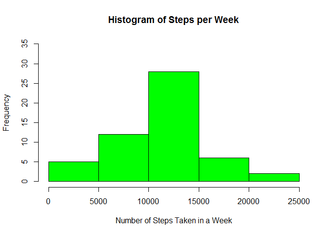
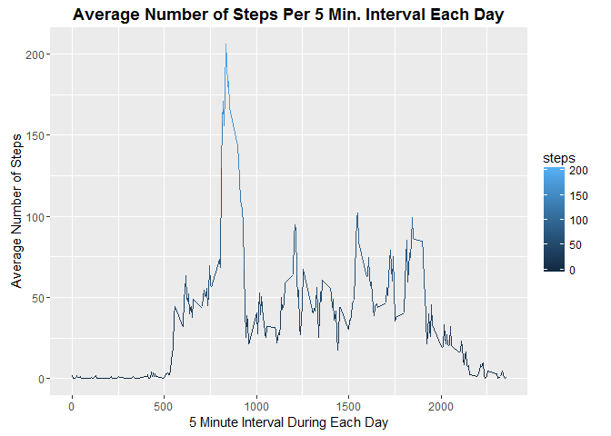
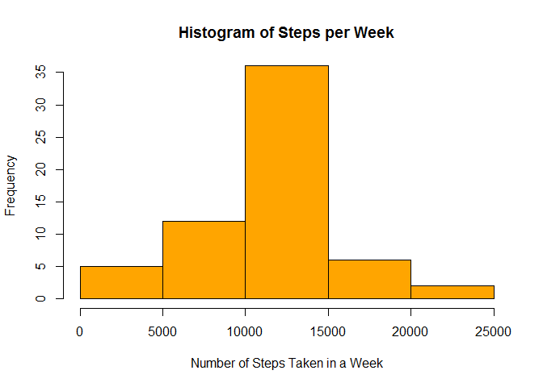
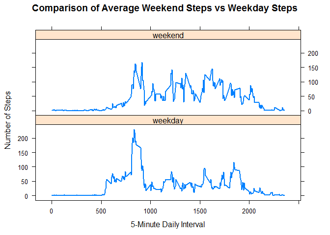

# Reproducible Research: Peer Assessment 1


## Loading and preprocessing the data
The data is sourced from: https://d396qusza40orc.cloudfront.net/repdata%2Fdata%2Factivity.zip

The date is the second column and that is converted in the call to read.csv().

```r
my.steps <- read.csv("activity.csv", 
                      header=TRUE, 
                      na.strings = "NA", 
                      stringsAsFactors = FALSE, 
                      colClasses = c("integer", "Date", "integer"))
```


## What is mean total number of steps taken per day?
The aggregate() function was used to calculate the mean total number of steps per day.

```r
total.steps.per.day <- aggregate(steps ~ date, my.steps, sum, na.action = na.omit)
```

The plotted data on a weekly basis appears as follows:

```r
DAYS.PER.WEEK <- 7
hist(total.steps.per.day$steps, 
     breaks = DAYS.PER.WEEK, 
     col= "green", 
     main = "Histogram of Steps per Week", 
     xlab = "Number of Steps Taken in a Week", 
     ylim=c(0,35))
```




The following was used for the daily average:

```r
mean.steps.per.day <- aggregate(steps ~ date, total.steps.per.day, mean, na.action = na.omit)
head(mean.steps.per.day)
```

```
##         date steps
## 1 2012-10-02   126
## 2 2012-10-03 11352
## 3 2012-10-04 12116
## 4 2012-10-05 13294
## 5 2012-10-06 15420
## 6 2012-10-07 11015
```


## What is the average daily activity pattern?
Here, we're calculating the average number of steps taken per 5-minute interval during the day:


```r
mean.steps.per.interval <- aggregate(steps ~ interval, my.steps, mean, na.action = na.omit)
```

As a plot: 

```r
ggplot(mean.steps.per.interval, aes(interval, steps, color = steps)) + geom_line() + xlab("5 Minute Interval During Each Day") + ylab("Average Number of Steps") + ggtitle("Average Number of Steps Per 5 Min. Interval Each Day" ) + theme(plot.title = element_text(lineheight=.9, face="bold"))
```



On interval 835, The Stepper took 206 steps on average. And that is the most they took on average across all the days in the dataset.


## Imputing missing values
The original dataset has several missing data values. They're represented as NA. The data for each 5-minute interval was calculated in mean.steps.per.interval. For step values that are represented as NA in the original dataset, a substitution is made using the average for that interval.


```r
        my.complete.steps <- 
          mutate(my.steps, 
                 steps = ifelse(is.na(my.steps$steps), 
                                mean.steps.per.interval[match(my.steps$interval, mean.steps.per.interval$interval),2], 
                                my.steps$steps))
```


Recalculate the total number of steps taken per day with the updated average values used for NA values.


```r
total.steps.per.day <- aggregate(steps ~ date, my.complete.steps, sum, na.action = na.omit)
head(total.steps.per.day)
```

```
##         date    steps
## 1 2012-10-01 10766.19
## 2 2012-10-02   126.00
## 3 2012-10-03 11352.00
## 4 2012-10-04 12116.00
## 5 2012-10-05 13294.00
## 6 2012-10-06 15420.00
```

This is how it looks on a weekly basis:

```r
        hist(total.steps.per.day$steps, 
             breaks = DAYS.PER.WEEK, 
             col= "orange", 
             main = "Histogram of Steps per Week", 
             xlab = "Number of Steps Taken in a Week",
             ylim=c(0,35))
```




## Are there differences in activity patterns between weekdays and weekends?


Start by Identifying the weekend days (day == 1 or 7) from the rest.

```r
        total.steps.per.daytype <- mutate(my.complete.steps, 
                                          daytype = ifelse(wday(my.complete.steps$date) == 1 | wday(my.complete.steps$date) == 7, "weekend", "weekday"))
```

Calculate the average steps per interval on a weekend

```r
        weekend.steps <- filter(total.steps.per.daytype, daytype == "weekend")
        weekend.steps.average <- aggregate(steps ~ interval, weekend.steps, mean)
        weekend.steps.average <- mutate(weekend.steps.average, daytype = "weekend")
        head(weekend.steps.average)
```

```
##   interval       steps daytype
## 1        0 0.214622642 weekend
## 2        5 0.042452830 weekend
## 3       10 0.016509434 weekend
## 4       15 0.018867925 weekend
## 5       20 0.009433962 weekend
## 6       25 3.511792453 weekend
```

Calculate the average steps per interval on a weekday

```r
        weekday.steps <- filter(total.steps.per.daytype, daytype == "weekday")
        weekday.steps.average <- aggregate(steps ~ interval, weekday.steps,mean)
        weekday.steps.average <- mutate(weekday.steps.average, daytype = "weekday")
        head(weekday.steps.average)
```

```
##   interval      steps daytype
## 1        0 2.25115304 weekday
## 2        5 0.44528302 weekday
## 3       10 0.17316562 weekday
## 4       15 0.19790356 weekday
## 5       20 0.09895178 weekday
## 6       25 1.59035639 weekday
```

Rejoin the two datasets. Both datasets calculate the average number of steps taken per interval. One average is over weekdays and the other weekends.

```r
        total.steps.per.daytype <- rbind(weekend.steps.average, weekday.steps.average)
```

Compose a panel plot contrasting the steps taken per interval on weekends and on weekdays.


```r
my.plot <- xyplot(steps ~ interval|as.factor(daytype),
                          total.steps.per.daytype,layout = c(1,2), 
                          ylab = "Number of Steps", 
                          xlab = "5-Minute Daily Interval", 
                          main="Comparison of Average Weekend Steps vs Weekday Steps", 
                          type="l",
                          lwd = 2)
print(my.plot)
```



The last plot show the average number of steps take during the day is higher on weekends that on weekdays. Possiby The Stepper has a desk-type position and need not move around too much.


